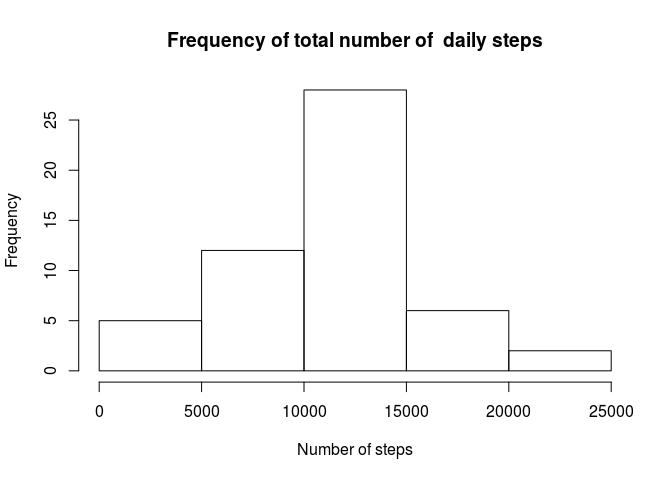
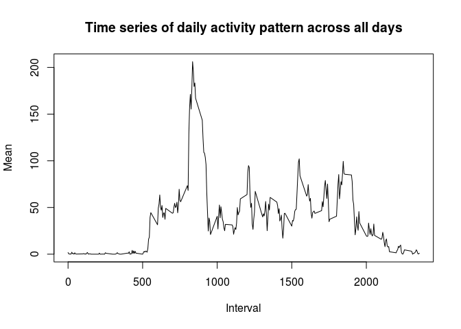
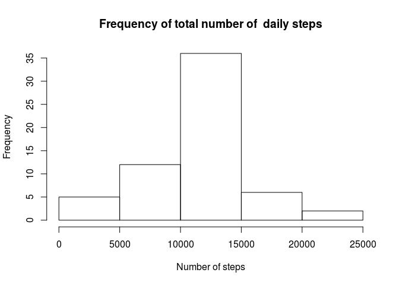
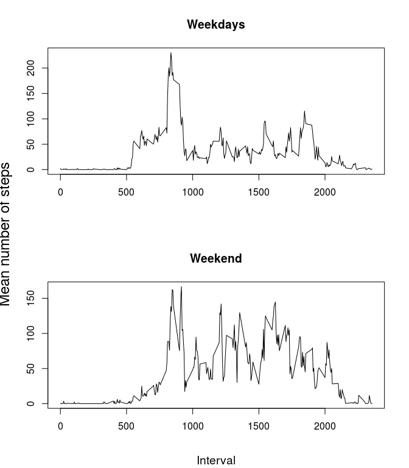

# Reproducible Research: Peer Assessment 1


## Loading and preprocessing the data

```r
unzip("activity.zip",overwrite=F)
```

```
## Warning in unzip("activity.zip", overwrite = F): not overwriting file './
## activity.csv
```

```r
dataRaw<-read.csv("activity.csv", header = T)
dataRaw$date<-as.Date(dataRaw$date, format = "%Y-%m-%d")
```
## What is mean total number of steps taken per day?


```r
## Find the total steps for each day
daily.sum<-aggregate(dataRaw$steps,by=list(dataRaw$date),FUN=sum)
## Give good names to each column
colnames(daily.sum)<-c("date","totalSum")
## Let's plot the histogram
hist(daily.sum$totalSum, xlab="Number of steps", main ="Frequency of total number of  daily steps" )
```

<!-- -->

```r
mean.raw<-mean(daily.sum$totalSum, na.rm=TRUE)
print(paste("Mean number of steps per day : ",mean.raw))
```

```
## [1] "Mean number of steps per day :  10766.1886792453"
```

```r
median.raw<-median(daily.sum$totalSum,na.rm =TRUE)
print(paste("Median number of steps per day: ",median.raw))
```

```
## [1] "Median number of steps per day:  10765"
```

## What is the average daily activity pattern?

```r
activity.pattern<-aggregate(dataRaw$steps,by=list(dataRaw$interval),FUN=mean, na.rm=TRUE)
colnames(activity.pattern)<-c("interval","mean")
plot(activity.pattern$interval,activity.pattern$mean, type = "l", xlab = "Interval",ylab = "Mean",main = "Time series of daily activity pattern across all days")
```

<!-- -->

```r
## Find the maximum interval of average daily activity
activity.pattern[which.max(activity.pattern$mean),]
```

```
##     interval     mean
## 104      835 206.1698
```

## Imputing missing values

## Checking where the missing values are:


```r
summary(dataRaw)
```

```
##      steps             date               interval     
##  Min.   :  0.00   Min.   :2012-10-01   Min.   :   0.0  
##  1st Qu.:  0.00   1st Qu.:2012-10-16   1st Qu.: 588.8  
##  Median :  0.00   Median :2012-10-31   Median :1177.5  
##  Mean   : 37.38   Mean   :2012-10-31   Mean   :1177.5  
##  3rd Qu.: 12.00   3rd Qu.:2012-11-15   3rd Qu.:1766.2  
##  Max.   :806.00   Max.   :2012-11-30   Max.   :2355.0  
##  NA's   :2304
```

Therefore only setps has missing values.  

We are going to replace "NA" values with the mean of each interval

```r
data<-merge(dataRaw,activity.pattern, by="interval")
for(i in 1:length(data$steps)){
  if (is.na(data[i,2])) {
    #print(data[i,2])
    data[i,2]<-data[i,4] 
  }
}
summary(data)
```

```
##     interval          steps             date                 mean        
##  Min.   :   0.0   Min.   :  0.00   Min.   :2012-10-01   Min.   :  0.000  
##  1st Qu.: 588.8   1st Qu.:  0.00   1st Qu.:2012-10-16   1st Qu.:  2.486  
##  Median :1177.5   Median :  0.00   Median :2012-10-31   Median : 34.113  
##  Mean   :1177.5   Mean   : 37.38   Mean   :2012-10-31   Mean   : 37.383  
##  3rd Qu.:1766.2   3rd Qu.: 27.00   3rd Qu.:2012-11-15   3rd Qu.: 52.835  
##  Max.   :2355.0   Max.   :806.00   Max.   :2012-11-30   Max.   :206.170
```
We are ready to produce the new histogram and check also for differences in the mean and median

## What is the average daily activity pattern?

```r
daily.sum.input<-aggregate(data$steps,by=list(data$date),FUN=sum, na.rm=TRUE)
## Give good names to each column
colnames(daily.sum.input)<-c("date","totalSum")
## Let's plot the histogram
hist(daily.sum.input$totalSum, xlab="Number of steps", main ="Frequency of total number of  daily steps" )
```

<!-- -->

```r
mean.input<-mean(daily.sum.input$totalSum, na.rm=TRUE)
print(paste("Mean number of steps per day : ",mean.input))
```

```
## [1] "Mean number of steps per day :  10766.1886792453"
```

```r
median.input<-median(daily.sum.input$totalSum,na.rm =TRUE)
print(paste("Median number of steps per day: ",median.input))
```

```
## [1] "Median number of steps per day:  10766.1886792453"
```
## Are there differences in activity patterns between weekdays and weekends?

Adding the new factor variable

```r
data$day<-weekdays(data$date)
weekdayNames<-c("Monday","Tuesday","Wednesday","Thursday","Friday")
data$factor.day<-factor(data$day %in% weekdayNames,levels=c(FALSE,TRUE), labels=c("weekend","weekday"))
```
Let's subset by the new factor variable:

```r
dataWeekdays<-data[ which(data$factor.day=="weekday"),]
dataWeekends<-data[ which(data$factor.day=="weekend"),]
```


## What is the average daily activity pattern?

Now let's find the daily mean by time periods.


```r
activity.pattern.weekday<-aggregate(dataWeekdays$steps,by=list(dataWeekdays$interval),FUN=mean, na.rm=TRUE)
colnames(activity.pattern.weekday)<-c("interval","mean")
activity.pattern.weekend<-aggregate(dataWeekends$steps,by=list(dataWeekends$interval),FUN=mean, na.rm=TRUE)
colnames(activity.pattern.weekend)<-c("interval","mean")
```
 A plot the time series for weekdays and weekends:

```r
par(mfcol=c(2,1))
plot(activity.pattern.weekday$interval,activity.pattern.weekday$mean, type = "l",xlab="", ylab="",main = "Weekdays")
plot(activity.pattern.weekend$interval,activity.pattern.weekend$mean, type = "l",xlab="", ylab="",main = "Weekend")
mtext("Interval", side=1, line=4, cex = 1.2)
par(oma=c(0,6,0,0))
mtext("Mean number of steps", side=2, line=5, cex=1.5, outer = T)
```

<!-- -->
